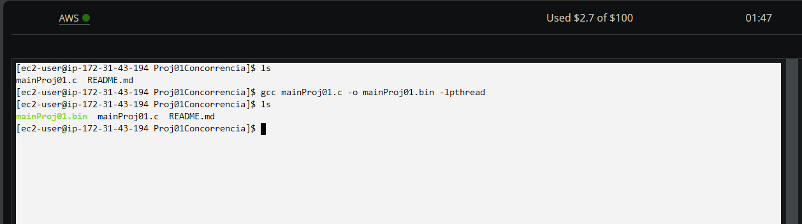
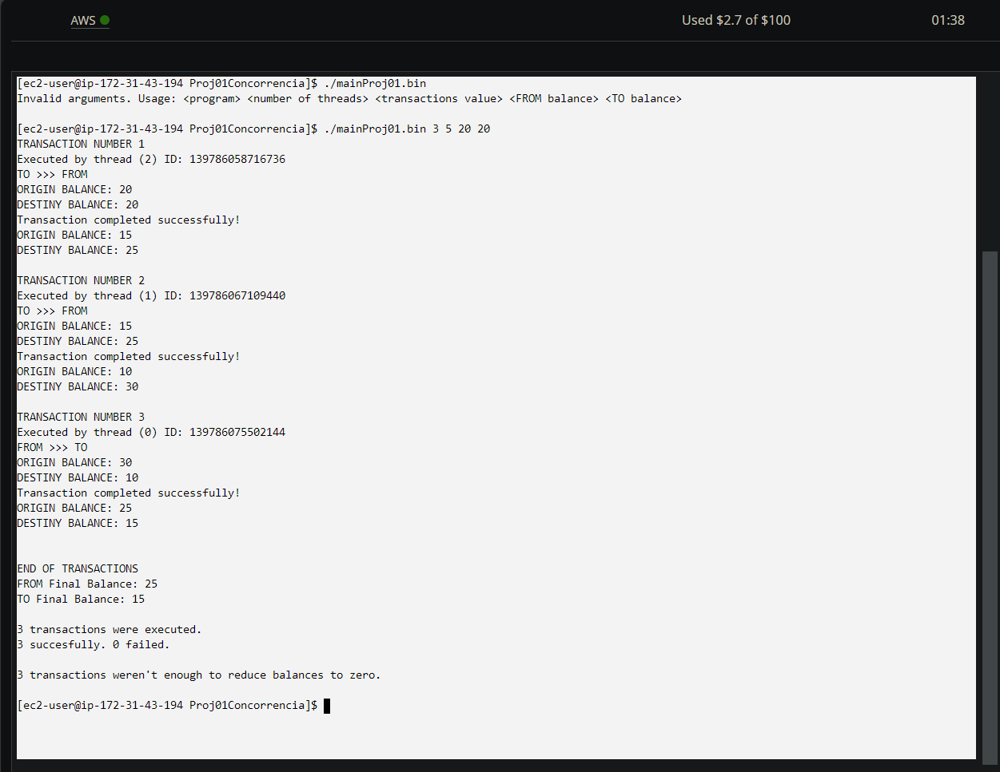
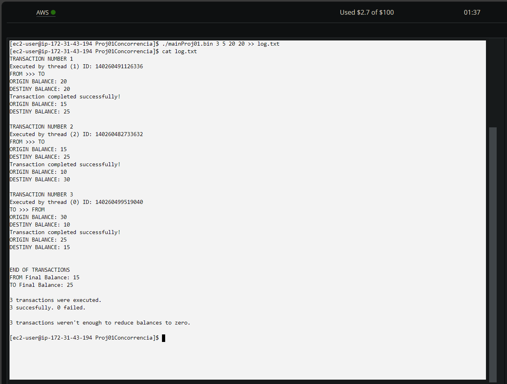

<h1>PROJETO 01: SISTEMAS OPERACIONAIS</h1>

Este é um programa <i>open-source</i> desenvolvido por <strong>Pedro Henrique Araujo Farias</strong>.

<h2>Sobre o problema proposto</h2>

No código demonstrado no enunciado do projeto, nota-se que o desenvolvedor deste não se atentou a estabelecer uma política de condição de corrida na execução de seu programa.

Dado este fato, ocorrem conflitos na execução do programa, uma vez que as diversas operações realizadas nos saldos das contas bancárias, compartilhados pelos diferentes subprocessos, tornam-se dessincronizadas.

Sendo assim, o objetivo do projeto é propor uma condição de corrida para garantir que as transações estejam sempre sincronizadas entre si, isto é, que estas sempre acessem os dados atualizados de saldo das contas bancárias.

<h2>Desenvolvimento</h2>

Como proposta de solução ao problema apresentado, foi implementada uma abordagem que se baseia na utilização de <i><strong>threads</strong></i> e do <i><strong>mutex</strong></i>:

<ul>
  <li>Cada <i>thread</i> será responsável por executar uma transação;</li>
  <li>A partir do <i>mutex</i>, será estabelecida uma condição de corrida que manterá as transações sincronizadas entre si.</li>
</ul>

De acordo com um dos requisitos do enunciado do projeto, o fluxo de transação pode ocorrer da conta FROM para a conta TO, bem como da conta TO para a conta FROM. Para implementar esta <i>feature</i>, foi implementada uma lógica que determina o fluxo de transação de modo <strong>aleatório</strong>.

<h3>Sobre o <i><strong>Mutex</strong></i></h3>

O <i>mutex</i> tem como objetivo gerenciar a execução das <i>threads</i> através do controle da condição de corrida.

Para isso, quando uma <i>thread</i> acessa a seção crítica do algoritmo, demarcada por <i>pthread_mutex_lock</i>, o <i>mutex</i> impedirá que outras <i>threads</i> acessem essa região até que a <i>thread</i> que já entrou na seção crítica chegue até o seu final, demarcado por <i>pthread_mutex_unlock</i>. Assim, garante-se que a próxima <i>thread</i> terá acesso ao saldo atualizado, o qual foi previamente alterado pela <i>thread</i> anterior.

O código-fonte deste projeto se encontra no arquivo <a href="https://github.com/K4NS0KUSH4/SOsV01D/blob/main/Proj01Concorrencia/mainProj01.c"  target="_blank">mainProj01.c</a>.

<h2>Compilação</h2>

O arquivo <i>main.Proj01.c</i> foi compilado no sistema operacional <i>Linux</i>, no ambiente da AWS.

Para compilá-lo, utilize o compilador <strong>GCC</strong>, uma vez que o código-fonte foi escrito na <strong>linguagem C</strong>. Utilize o argumento <i>"-o"</i> para determinar que o arquivo gerado pelo compilador seja de extensão <strong>.bin</strong>. Não se esqueça de utilizar o argumento <i>"-lpthread"</i> para ativar a biblioteca de <i>threads</i>.

<h2>Execução</h2>

Após compilar o arquivo do código-fonte de acordo com a imagem anterior, o compilador gerará um arquivo de extensão .bin.

Para executá-lo: 

Note que, na primeira tentativa de execução, recebemos uma mensagem indicando a passagem incorreta de argumentos para a execução do programa. Atente-se aos argumentos que devem ser passados: <strong>nome do .bin</strong>, <strong>número de <i>threads</i></strong>, <strong>valor das transações</strong>, <strong>saldo inicial da conta FROM</strong> e <strong>saldo inicial da conta TO</strong>.

Vale ressaltar que, como se pode observar no exemplo acima, a execução do programa gera uma saída com muito conteúdo, o que pode dificultar sua visualização no terminal. Por isso, recomenda-se que a saída do programa seja armazenada em um <strong>arquivo .txt</strong>. Para isso, basta adicionar ">> <i>nome_do_arquivo.txt</i>" ao fim do comando de execução. Para visualizar o arquivo e constatar que este armazenou corretamente o <i>output</i> do programa, utilize o comando "<i>cat nome_do_arquivo.txt</i>". Segue o exemplo:

<h2>Avaliando e comprovando o êxito da solução</h2>

O objetivo do programa desenvolvido, como cita o enunciado, é tornar o saldo de uma das contas nulo a partir de sucessivas transações.

Para comprovar que os resultados propostos foram alcançados, devem estar explícitas as seguintes possíveis situações:

<ul>
  <li>Nenhuma das contas tem seu saldo zerado. Todas as transações são realizadas com êxito;</li>
  <li>Nenhuma das contas tem seu saldo zerado. Algumas transações falham devido à insuficiência de saldo da conta de origem da transação;</li>
  <li>Uma das contas tem seu saldo zerado. Todas as transações são realizadas com êxito;</li>
  <li>Uma das contas tem seu saldo zerado. Apenas as transações necessárias para zerar o saldo de uma das contas são realizadas com êxito;</li>
  <li>Uma das contas tem seu saldo zerado. Algumas transações falham devido à insuficiência de saldo da conta de origem da transação.</li>
</ul>

Quando nenhuma das contas tem seu saldo zerado, o programa retorna uma mensagem informando que o número de transações aleatórias não foi suficiente para zerar pelo menos uma das contas.

Quando pelo menos uma das contas tem seu saldo zerado, as demais <i>threads</i> não realizam mais transações, uma vez que o objetivo proposto foi alcançado.

Algumas transações podem falhar devido à insuficiência de saldo da conta de origem. Por exemplo, caso a conta A tenha saldo de R$20,00, esta não poderá realizar uma transação de R$50,00.

Ao final de cada uma das execuções, o programa gera um <i>feedback</i> apontando o saldo final das contas bancárias e o número de <i>threads</i> que realizaram transações, bem como o número de êxitos e fracassos de tentativas de transação.

 

Para acessar alguns dos testes executados previamente, acesse os seguintes arquivos de log:

<ul>
  <li><a href="log100threads.txt">Execução com 100 <i>threads</i></a>;</li>
  <li><a href="log500threads.txt">Execução com 500 <i>threads</i></a>;</li>
  <li><a href="log1000threads.txt">Execução com 1000 <i>threads</i></a>;</li>
  <li><a href="log332transaction.txt">Execução com 500 <i>threads</i> e 332 de valor de transações</a>.</li>
</ul>
